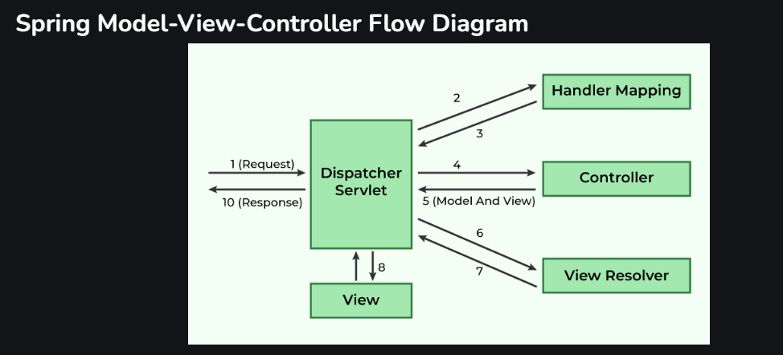

## What is MVC Pattern?

Model View Controller Design Pattern: Separation of Concerns to achieve loose coupling 

- Controller
  - Controls the flow & decides which business logic needs to be executed. It acts as a brain inside MVC pattern
- View
  - Represents UI and usually takes data from the controller and displey it with the help of HTML pages
- Model
  - Represents the data of the application list etc. It stores & manages the data

## What Dispatcher Servlet have?

[Spring MVC Dispatcher Servlet - MORE INFO](https://www.geeksforgeeks.org/spring-mvc-framework/)

- Dispatcher Servlet
  - Handler Mapping
  - Controller
  - View Resolver

